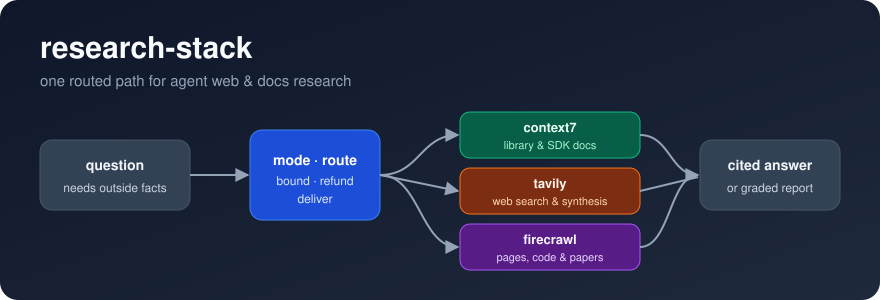

<p align="center">
  
</p>

<h1 align="center">research-stack</h1>

<p align="center">
  A general-purpose research skill for coding agents.<br>
  One routed path across <b>context7</b>, <b>tavily</b>, and <b>firecrawl</b> — pick the right tool, bound its cost, cite the source.
</p>

<p align="center">
  <a href="LICENSE"></a>
  
  
</p>

---

## Why

Agents with three research MCP servers tend to call the wrong one, call it
unbounded, forget to cite, and treat one source as proof. This skill fixes the
process, not the tools. It picks a mode first:

- **Lookup**: one fact with one owner. Answered in a single routed pass.
- **Investigate**: several facets, a contested claim, or a decision riding on
  the answer. Runs scope → gather → triangulate → stress-test → synthesize.

Every call in either mode takes the same five steps:

| Step | What the agent does |
|---|---|
| **Load** | One `ToolSearch` for exactly the tools the route needs |
| **Route** | Match the question to a tool via a single table, with a fallback per row |
| **Bound** | Set the cost ceiling on every call before issuing it |
| **Refund** | Claim the firecrawl search-feedback credit |
| **Deliver** | A cited chat answer, or a structured report with graded sources |

A lookup is done when every claim traces to a source URL or library ID. An
investigation is done when every load-bearing claim has two independent
sources or an explicit `single-source` label, and every contradiction found is
resolved or reported.

## Install

**Claude Code** (personal skill, available in every project):

```bash
git clone https://github.com/PyModel/research-stack-skill.git ~/.claude/skills/research-stack
```

Project-scoped instead: clone into `<repo>/.claude/skills/research-stack`.

**Other agents** (Codex, Cursor, pi, any `SKILL.md`-aware host): drop the
folder wherever that host reads skills, or point the agent at `SKILL.md`.

## Requirements

Three MCP servers connected to the agent, under these tool prefixes:

| Server | Prefix | Get it |
|---|---|---|
| Context7 | `mcp__context7__*` | https://github.com/upstash/context7 |
| Tavily | `mcp__tavily__*` | https://github.com/tavily-ai/tavily-mcp |
| Firecrawl | `mcp__firecrawl__*` | https://github.com/firecrawl/firecrawl-mcp-server |

Any subset works; the route table's fallback column covers a missing server.

## Layout

```
research-stack/
├── SKILL.md                      # mode switch + load → route → bound → refund → deliver
├── references/
│   ├── investigate.md            # multi-source method and report shape
│   └── costs-and-limits.md       # credit tables, rate limits, security notes, sources
└── assets/
    └── research-stack.svg
```

`SKILL.md` is what the agent runs. `references/investigate.md` loads only in
Investigate mode; `references/costs-and-limits.md` only when the agent needs to
justify a tool choice on cost or cite a claim.

## Triggers

The skill fires when a question needs facts from outside the repo:

- library / SDK docs, a version-specific behavior
- current events, "latest", a comparison across sources
- the contents of a known URL, or which pages of a site matter
- a known bug, error message, or API contract
- papers and scientific literature
- an open-ended question that needs a multi-source investigation
- or when the agent is unsure which of the three servers fits

## Contributing

Pricing, rate limits, and tool schemas drift. Each fact has one home:
parameter names and call shapes in `SKILL.md` § Bound, prices and limits in
`references/costs-and-limits.md`. When a loaded tool schema or a vendor page
disagrees, fix that one place and cite the source in the PR.

## License

[MIT](LICENSE)
